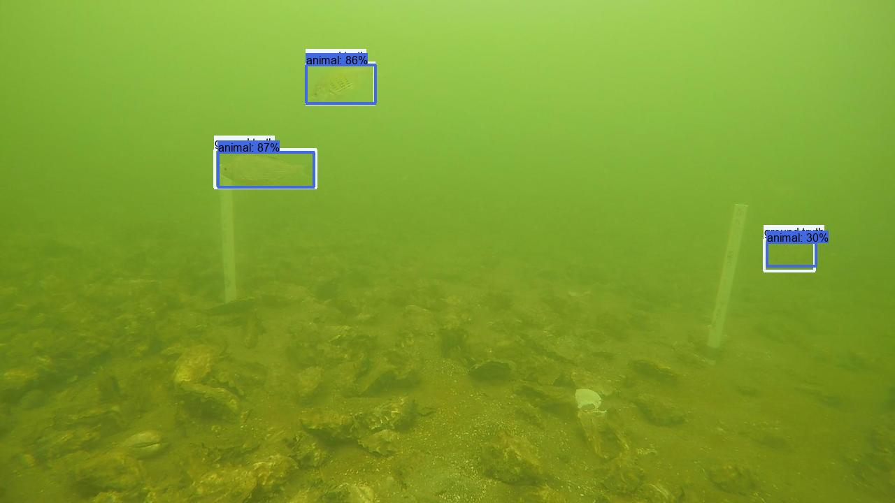

## NOAA Puget Sound Nearshore Fish data curation code

### Overview

The code in this folder prepares data for the <a href="https://lila.science/datasets/noaa-puget-sound-nearshore-fish">NOAA Puget Sound Nearshore Fish</a> dataset on <a href="https://lila.science/">lila.science</a>, and trains a preliminary detector.

Gratuitous image with ground truth and predicted bounding boxes, from the <a href="https://lila.science/public/noaa-fish-yolo-results/val-postprocessing/index.html">results on the validation locations</a>:

### Files

#### prepare-noaa-fish-data-for-lila.py

Given the Excel file provided by NOAA, prepare data in COCO format for release on LILA.

#### prepare-noaa-fish-data-for-training.py

* Convert annotations from COCO format to YOLO format
* Split locations into train/val
* Train YOLOv5 (command-line instructions, not done programmatically)
* Validate and preview training results on train/val data

