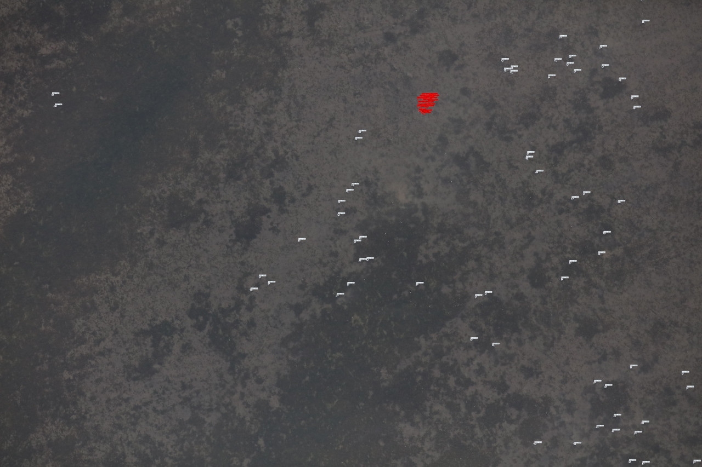

## USGS goose detector training

### Overview

The code in this folder trains and evaluates models to detect geese in aerial images, based on the <a href="https://www.usgs.gov/data/aerial-photo-imagery-fall-waterfowl-surveys-izembek-lagoon-alaska-2017-2019">Izembek Lagoon dataset</a>.

There are around 100,000 images total, about 95% of which contain no geese.  Images are 8688 x 5792.  A typical image looks like this:

The annotations you can vaguely see as different colors correspond to different species of goose.  Most of this repo will operate on 1280x1280 patches that look like this:

### Files

#### usgs-geese-data-import.py

* Match images to annotation files
* Read the original annotations (in the format exported by [CountThings](https://countthings.com/))
* Convert to COCO format
* Do a bunch of miscellaneous consistency checking

#### usgs-geese-training-data-prep.py

* For all the images with at least one annotation, slice into mostly-non-overlapping patches
* Optionally sample hard negatives
* Split into train/val
* Export to YOLO annotation format

#### usgs-geese-training.py

Training happens at the YOLOv5 command line, but this script keeps track of the commands used for training and validation.

#### usgs-geese-inference.py

* Split images into overlapping patches
* Run inference on each patch
* Resolve redundant detections

